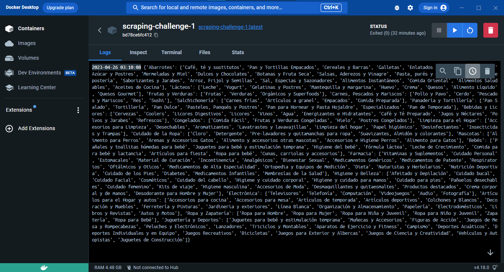
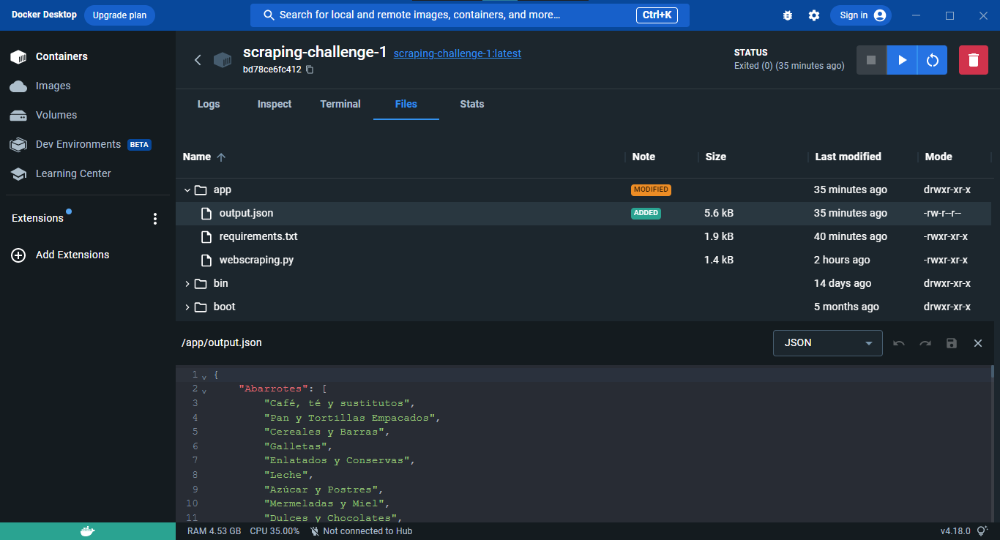

# Reporte Challenge Técnico #1
## Web Scraping con Python y BeautifulSoup

#### F. Javier Morales M.

#### Sitio: https://super.walmart.com.mx/all-departments

## Sistema y herramientas
- **Windows 10** Pro x64 21H2
- **Anaconda3** - conda 4.11.0
- **Python 3.11.3** en ambiente virtual (conda env)
- **Atom** Editor 1.55.0
- **Docker Desktop** 4.18.0
- **git** version 2.30.1.windows.1
- **GitHub**

## Librerías utilizadas
- `Requests`: Para el acceso al sitio web.
- `BeautifulSoup`:  para la manipulación de contenido ***html***.
- `json`: Para la generación de contenido estructurado `JSON`.
- `Pandas`: Para la visualización de los datos (opcional para uso con **Jupyter Notebook**).

## Detalles de ejecución
Al ejecutar las siguiente líneas de código

```python
url = 'https://super.walmart.com.mx/all-departments'
response = requests.get(url)
soup = bs(response.text, 'html.parser')
```
se obtiene la siguiente respuesta:

```html
<html><head>
<title>Access Denied</title>
</head><body>
<h1>Access Denied</h1>

You don't have permission to access "http://super.walmart.com.mx/all-departments" on this server.<p>
Reference #18.8fb53b17.1682492087.16873dff
</p></body>
</html>
```

La cual se puede deber a una restricción de seguiridad de acceso al contenido por parte del sitio.

Al buscar información en foros de ayuda  ([StackOverflow](https://stackoverflow.com/questions/62422172/error-you-dont-have-permission-to-access-url-on-this-server-in-beautiful-so)), encontré que se puede solucionar agregando un diccionario con información adicional como el `User-Agent` en el parámetro `headers` de la petición del `requests.get()`:

```python
url = 'https://super.walmart.com.mx/all-departments'
header = {'User-Agent': 'Mozilla/5.0 (Windows NT 10.0; Win64; x64) AppleWebKit/537.36 (KHTML, like Gecko) Chrome/58.0.3029.110 Safari/537.36 Edge/16.16299'}
response = requests.get(url, headers=header)
soup = bs(response.text, 'html.parser')
```

## Procedimiento
Una vez solucionado el acceso al sitio se hace una inspección con el `DevTools` para identificar los elementos `tag` y `class` que contienen la información principal solicitada. Los cuales son los `div class="flex flex-column"`.

```python
divs = soup.find_all('div', {'class': 'flex flex-column'})
```

Posteriormente de cada contenedor `div` se extrajo la información del nombre de cada departamento ubicado en el tag `h2 class="ma0"`, y los nombres de las subcategorias del tag `li class="pv1 pv0-m"` de cada contenedor `ul class="pt2 pl0 list"` con el siguiente ciclo `for`:

```python
result = dict()
for div in divs:
    h2 = div.find('h2', {'class': 'ma0'}).text.strip()
    ul = div.find('ul', {'class': 'pt2 pl0 list'})
    lis = ul.find_all('li', {'class': 'pv1 pv0-m'})
    lis_text = [li.text.strip() for li in lis]
    result[h2] = lis_text
```

Se imprime la variable `result` en la linea de comandos y se genera el archivo `JSON` con la función `dump()` de la librería `json`:

```python
print(result)
with open('output.json', 'w', encoding='utf-8') as f:
    json.dump(result, f, ensure_ascii=False, indent=4)

```

Al final se obtiene la información estructurada en el archivo `output.json`:

```json
{
    "Abarrotes": [
        "Café, té y sustitutos",
        "Pan y Tortillas Empacados",
        "Cereales y Barras",
        "Galletas",
        "Enlatados y Conservas",
        ...

    ],
    "Lácteos": [
        "Leche",
        "Yogurt",
        "Gelatinas y Postres",
        ...
    ],
    "Frutas y Verduras": [
        "Frutas",
        "Verduras",
        "Orgánicos y Superfoods"
        ...
    ],
    ...
    etc
}
```

## Dockerfile
Se instaló la aplicación de escritorio **Docker Desktop** descargando el instalador desde la página oficial de [Docker](https://www.docker.com/). Una vez instalado es necesario cerrar sesión para iniciar el programa.

Posteriormente se elaboró el siguiente `Dockerfile` en la carpeta del proyecto:

```bash
# Imagen base de Python
FROM python:3.10

# Directorio del contenedor
WORKDIR /app

# Archivos necesarios para el contenedor
COPY requirements.txt ./
COPY webscraping.py ./

# Instalacion de dependencias
RUN pip install --no-cache-dir -r requirements.txt

# Ejecucion del script
CMD ["python", "webscraping.py"]

```

Desde la linea de comandos se generó la imagen del contenedor con el siguiente comando, utilizando el parámetro `--tag, -t` para darle un nombre a la imagen (`scraping-challenge-1`).

```bash
docker build -t scraping-challenge-1 .
```

Una vez generada la imagen se corrió el contenedor desde la aplicación **Docker Desktop** y se obtuvo lo siguiente:


Resultado de la linea de comandos



Archivo `output.json` generado


### Detalles del Dockerfile


1. Al intentar generar la imagen a partir del `Dockerfile` me dio un error con los paquetes `pywin32` y `pywinpty` durante la instalación de las dependencias del `requirements.txt`. Ya que los contenedores `Docker` ya contienen python instalado y corren en un sistema `linux` ambos paquetes no son necesarios/compatibles. [Docker Community Forums](https://forums.docker.com/t/dockerfile-error-run-pip-install-r-requirements-txt/128194), [Streamlit](https://discuss.streamlit.io/t/error-could-not-find-a-version-that-satisfies-the-requirement-pywin32-301-from-versions-none/15343)

    #### **Solución**:
    Eliminar de la lista de dependencias del `requirements.txt` las lineas `pywin32==306` y `pywinpty==2.0.10` y volver a ejecutar el comando `docker build` mencionado anteriormente.

2. Durante la instalación de las dependencias, algunos paquetes dieron error por incompatiblidad con mi versión de `Python 3.11.3` y decía que tenía que ser con una versión `>= 3.7` o `< 3.11`.

    #### **Solución**:
    Cambiar la versión a instalar en el `Dockerfile`. En mi caso puse `FROM python:3.10` para instalar `Python 3.10` en la imagen.
